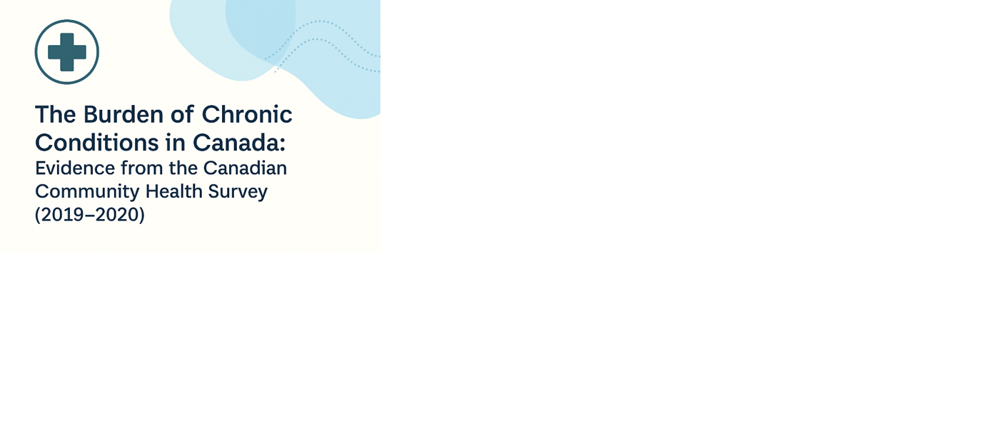
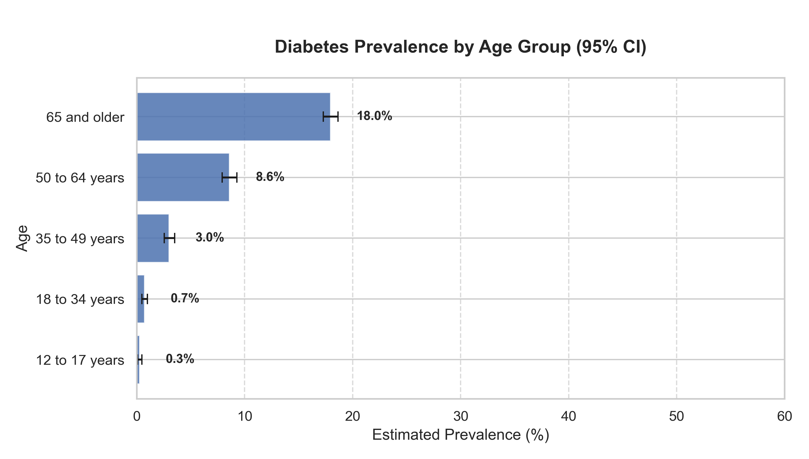

# 🧠 Healthcare Analytics Project

## Overview
This project investigates the **prevalence and practical significance of chronic health conditions** in Canada and Ontario using microdata from the **Canadian Community Health Survey (CCHS 2019–2020)**.  
The analysis is stratified by **age, sex, income, and province** to explore how health disparities manifest across demographics and geography.  
A special focus is placed on **health equity**, highlighting how social determinants shape chronic disease prevalence.

---

## 📑 Featured Reports

### 🇨🇦 Canada-Wide Analysis
- **[Canada_ChronicConditions_Report_WithNotes_2019-2020.pdf](reports/Canada_ChronicConditions_Report_WithNotes_2019-2020.pdf)**  
  Comprehensive national-level study of 10 chronic conditions.  
  Includes a clarifications page at the end highlighting data limitations and methodological notes.  

- **[Canada_ChronicConditions_LiteratureReview_2025.pdf](reports/Canada_ChronicConditions_LiteratureReview_2025.pdf)**  
  Literature review situating national findings within Canadian and international evidence on chronic disease and health equity.  

---

### 🏥 Ontario-Focused Analysis
- **[Ontario_ChronicConditions_Report_2019-2020.pdf](reports/Ontario_ChronicConditions_Report_2019-2020.pdf)**  
  Ontario-specific prevalence and inequities study.  
  Key finding: Ontario mirrors Canada overall, but disparities by **age** and **income** are stark.  

- **[Ontario_ChronicConditions_LiteratureReview_2025.pdf](reports/Ontario_ChronicConditions_LiteratureReview_2025.pdf)**  
  Companion literature review highlighting Ontario-specific research, persistent inequities, and relevant public health frameworks.  

---


## 📂 Project Structure

```
Healthcare-Analytics-Project/
│
├── notebooks/
│ ├── 01_CCHS_ChronicConditions_Stratification.ipynb
│ ├── 02_CCHS_National_Inferential_Stats.ipynb
│ └── 03_CCHS_Practical_Significance.ipynb
│
├── reports/
│ ├── Canada_ChronicConditions_Report_WithNotes_2019-2020.pdf
│ ├── Canada_ChronicConditions_LiteratureReview_2025.pdf
│ ├── Ontario_ChronicConditions_Report_2019-2020.pdf
│ └── Ontario_ChronicConditions_LiteratureReview_2025.pdf
│
└── README.md
```


### 📓 Notebooks
- **Stratification**: Calculates prevalence across conditions and demographic groups.  
- **Practical Significance**: Identifies absolute differences, relative risks, and Cramér’s V associations.  
- **Inferential Stats**: Bootstrapped estimates for confidence intervals and national-level comparisons.  

---

## 📊 Sample Output

Example: **Diabetes prevalence by age group** (with 95% confidence intervals).



---

## 🔐 Data Availability
**The data is not publicly shared in this repository** due to confidentiality restrictions under the Public Use Microdata File (PUMF) licensing agreement.  

To obtain access to the CCHS dataset, please visit:  
🔗 [Statistics Canada – Canadian Community Health Survey (CCHS)](https://www150.statcan.gc.ca/n1/en/catalogue/82M0013X)

---

## 📜 License
This project is licensed under the [MIT License](https://opensource.org/licenses/MIT).  
You are free to reuse, adapt, and build upon this work with proper attribution.

---

## ✍️ Author
**Arun Acharya**  
Data Analyst | Healthcare Researcher  
📍 Ottawa, Canada  
🔗 [GitHub Profile](https://github.com/arun-data-analyst)

