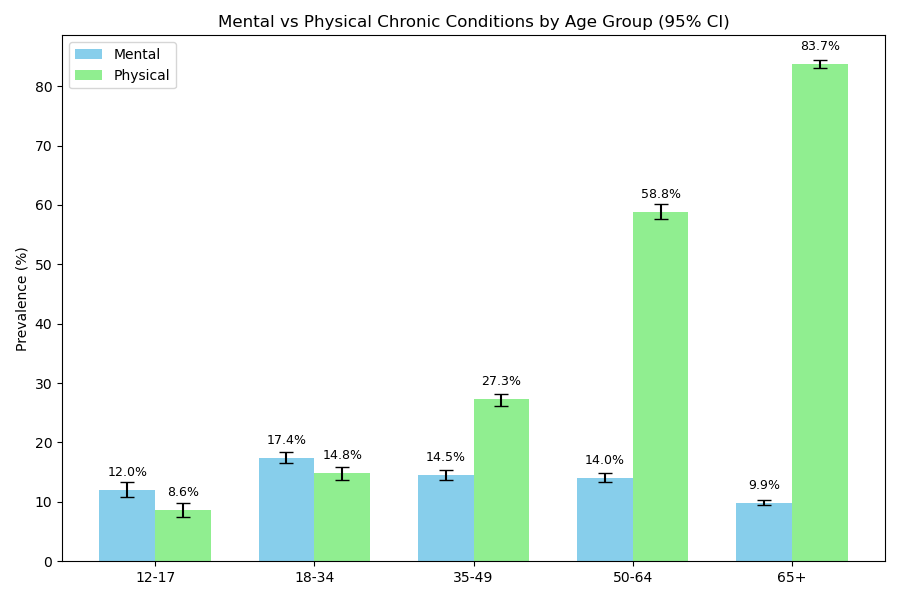
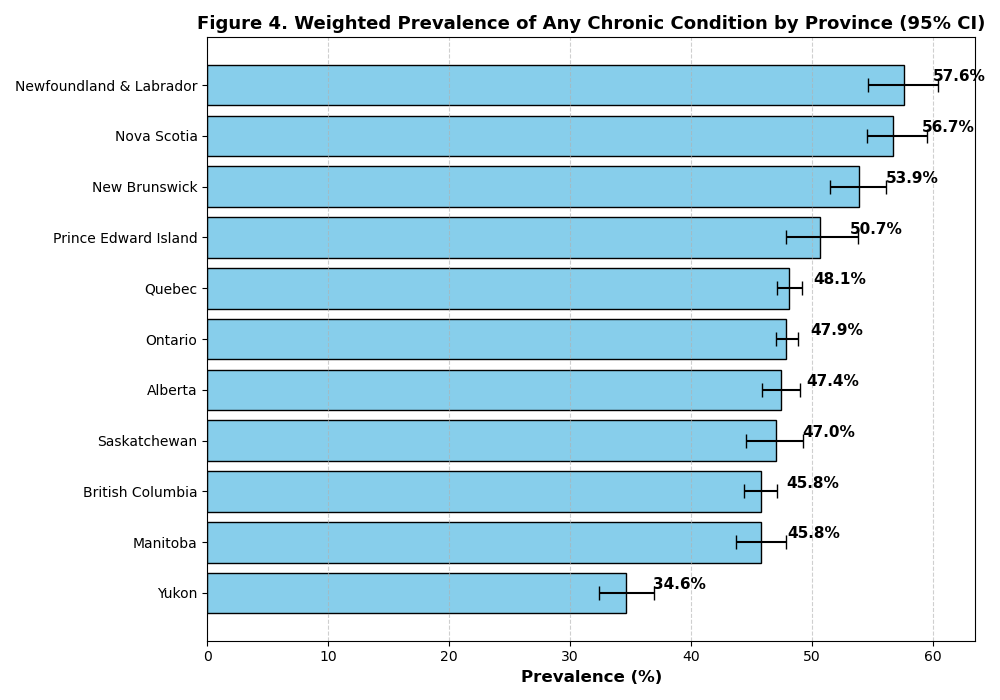

# Healthcare Analytics: Chronic Disease Prevalence in Canada and Ontario

This repository contains a detailed, statistics‑driven exploration of chronic disease prevalence in Canada, based on the **Canadian Community Health Survey (CCHS) 2019–20** micro‑data. The analysis is split into a national overview and an Ontario deep‑dive, with the goal of turning complex data into actionable insights for public‑health decision‑makers.

## 🗾° What You’ll Find

- **National report:** Quantifies the burden of ten chronic conditions, comparing mental vs. physical health and exploring variations across age, gender, income and province.
- **Ontario report:** Benchmarks Ontario against the national average and highlights internal disparities driven by age and income.
- **Statistical methodology:** Uses survey weights, 1 000 bootstrap replicates and measures of association like Cramér’s V, absolute differences and relative risks【38415751756450†L72-L79】.
- **Professional‑grade reports:** Includes polished PDF reports and literature reviews for both Canada and Ontario in the `reports/` folder.

## ✨ Quick Highlights

- **Age gradient:** 83.7 % of seniors have at least one chronic condition versus 19 % of adolescents【38415751756450†L39-L43】.
- **Mental vs. physical health:** Mental health disorders peak in young adulthood (17.4 % among 18–34‑year‑olds) while physical ailments climb steadily with age【38415751756450†L39-L46】.
- **Gender gap:** Women are 1.6 × more likely than men to report mood or anxiety disorders【38415751756450†L47-L49】.
- **Regional variation:** Atlantic provinces (e.g., Newfoundland & Labrador at 57.6 %) show the highest burden, whereas Ontario’s overall prevalence closely mirrors the national average【38415751756450†L50-L57】.
- **Internal disparities in Ontario:** High blood pressure skyrockets from 0.1 % among adolescents to 52.4 % among seniors, and musculoskeletal conditions are nearly twice as prevalent in the lowest‑income group as in the highest【38415751756450†L55-L63】.

## 🥬 Methodology

1. **Data selection & cleaning:** Selected relevant variables (age, sex, income, province, chronic condition indicators) from the CCHS micro‑data.
2. **Weighting & estimation:** Applied survey and replicate weights to calculate prevalence estimates and 95 % confidence intervals.
3. **Association metrics:** Used Cramér’s V, absolute differences and relative risks to assess the magnitude of disparities【38415751756450†L72-L79】.
4. **Visualization & reporting:** Produced interactive notebooks and polished PDF reports summarising national and provincial findings.

## 🖼 Sample Visuals



*Mental vs. physical health prevalence by age group.*



*Overall prevalence of chronic conditions across provinces.*

## 📦 Repository Structure

```
Healthcare-Analytics-Project/
├── notebooks/
│   ├── 01_CCHS_ChronicConditions_Stratification.ipynb
│   ├── 02_CCHS_National_Inferential_Stats.ipynb
│   ├── 03_CCHS_Practical_Significance.ipynb
│   ├── 04_Ontario_Statistical_Significance
│   └── 05_Ontario_Quantifying_Disparities
├── plots/
│   └── National_Level/
│       ├── ChronicConditions_AveragePrevalence.png
│       ├── ChronicConditions_ByProvince.png
│       ├── Mental_vs_Physical_ByAgeGroup.png
│       └── Mental_vs_Physical_ByGender.png
├── reports/
│   ├── Canada_ChronicConditions_Report_WithNotes_2019-2020.pdf
│   ├── Canada_ChronicConditions_LiteratureReview_2025.pdf
│   ├── Ontario_ChronicConditions_Report_2019-2020.pdf
│   └── Ontario_ChronicConditions_LiteratureReview_2025.pdf
├── LICENSE
├── README.md  # Project overview (this file)
└── requirements.txt
```

## 🏃 How to Run

1. Clone the repository and install dependencies:

```bash
git clone https://github.com/arun-data-analyst/Healthcare-Analytics-Project.git
cd Healthcare-Analytics-Project
pip install -r requirements.txt
```

2. Launch Jupyter Notebook and open the notebook of interest:

```bash
jupyter notebook notebooks/01_CCHS_ChronicConditions_Stratification.ipynb
```

3. For the full narrative, see the PDF reports in the `reports/` folder.

## 👤 Author

**Arun Acharya** – *Data Analyst (Ottawa, Canada)*

---

*Questions or feedback? Connect with me on [LinkedIn](https://www.linkedin.com/in/arun-acharya-26077a362) or explore my other data projects on [GitHub](https://github.com/arun-data-analyst).*
